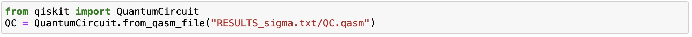
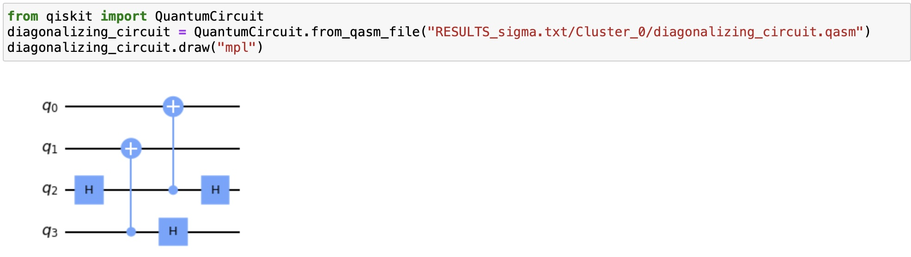

## QC Hamiltonian Compilation

### PURPOSE:  Compile a quantum circuit of the *Hamiltinian Time Evolution Operator*

### Author: EDISON MURAIRI [(LinkedIn Profile)](https://www.linkedin.com/in/edison-murairi/)

### Citing: Copy and Paste into the Bib file:
<code>
@article{PhysRevD.106.094504, 
  title = {How many quantum gates do gauge theories require?}, 
  author = {Murairi, Edison M. and Cervia, Michael J. and Kumar, Hersh and Bedaque, Paulo F. and Alexandru, Andrei}, 
  journal = {Phys. Rev. D}, 
  volume = {106}, 
  issue = {9}, 
  pages = {094504}, 
  numpages = {13}, 
  year = {2022}, 
  month = {Nov}, 
  publisher = {American Physical Society}, 
  doi = {10.1103/PhysRevD.106.094504}, 
  url = {https://link.aps.org/doi/10.1103/PhysRevD.106.094504} 
}
</code>

### QUICK TUTORIAL
This tutorial walks the user through using this compiler with the default parameters.   
- __Step 0__:
> Expand the Hamiltonian as a linear combination of Pauli Operators (Pauli Strings).
- __Step 1__:
> Prepare the Hamiltonian File:
The Hamiltonian file is a CSV file. Each line representts a Pauli operator and its coefficient.  
Therefore, each line has two columns:
> > The first column is a Pauli operator writen as a string of the Pauli matrices  
> > The second column is just the coefficient of the Pauli operator (with the minus sign if necessary).  
> > The first and second columns are separated by a comma and there is no space before or after the comma. 

__Example__: The Hamiltonian file: *sigma.csv* 
<code>
ZZII,-0.25  
ZIII,-0.25  
IZII,-0.25  
IIZZ,-0.25  
IIZI,-0.25  
IIIZ,-0.25  
IYIY,0.3  
YZYZ,0.3  
YXYX,0.3 
</code>

- __Step 2__: Run the compiler  
> Using the terminal, navigate to the *QC_Hamiltonian_Compilation* folder  
> Type the command _python3 compiler.py -f \<path to the Hamiltonian file\>  -o \<output_file\>_  
> The circuit will be compiled and a folder called RESULTS_\<output_file\> will be created.  
> In the results folder, there is a file __QC.qasm__. It contains the final quantum circuit.  

- __Step 3__: Reading the QC.qasm file   
> The qasm format can be read by most quantum computing platforms. 
> In qiskit for example, it can be read as follow:  

### ADVANCED TUTORIAL

#### SPECIFY THE GROUPING STRATEGY:
One step of the compiler is to group the Pauli strings into clusters (sets) in which all the Pauli strings commute. 
In principle, it is desirable to use a few clusters as possible.  

The grouping is done via graph coloring. The coloring strategies (as implemented in NETWORKX) available are 
- DSATUR: Default  
- largest_first  
- random_sequential  
- smallest_last  
- independent_set  
- connected_sequential_bfs  
- connected_sequential_dfs  
- saturation_largest_first  

To specify the stratgy, add the parameter *-g \<name_of_the_strategy\>* when running the compiler.  
For example, to group the Pauli strings with the *indepndent_set* strategy, type the command:  
> > *python3 compiler.py -f \<path to the Hamiltonian file\>  -o \<output_file\> -g independent_set*  

#### VIEWING THE INTERMEDIATE RESULTS:
> The intermediate results are stored in the RESULTS_\<output_file\> folder.  
> There is a folder with name starting with *Cluster_* for each set of commuting Pauli strings.  
> Each Cluster Folder contains 4 files:
- __commuting_pauli_strings.npy__: The list of the Pauli strings in this cluster.  
> > Extract this list using NUMPY LOAD  
> > Import the Module pstring provided by our codes. Print the Pauli strings.   

- __diagonalized_pauli_strings_tableau.npy__:
> > This file contains the diagonalized Pauli strings in Tableau Representation: X, Z, S, Coefs.  
> > - X: Contains only 0 (since the Pauli strings are diagonal).  
> > - Z: Each row of Z is a Pauli string. 0 means the Pauli matrix is the identity. 1 means the Pauli matrix is the z pauli matrix.  
> > - S: Each row of S contains the sign of the Pauli string. 0 means the sign is + (plus) and 1 means the sign is - (minus).
> > - Coefs: Each row contains the absolute value of the Coeficient of the Pauli string.

_ **diagonalizing_circuit.qasm**: The quantum circuit of the unitary operator that simultaneously diagonalizes these commuting Pauli strings. 

_ __time_evolution_circuit.qasm__: The circuit of the time evolution operator of the diagonalized Pauli strings. 
The circuit can be read as in the example above.
